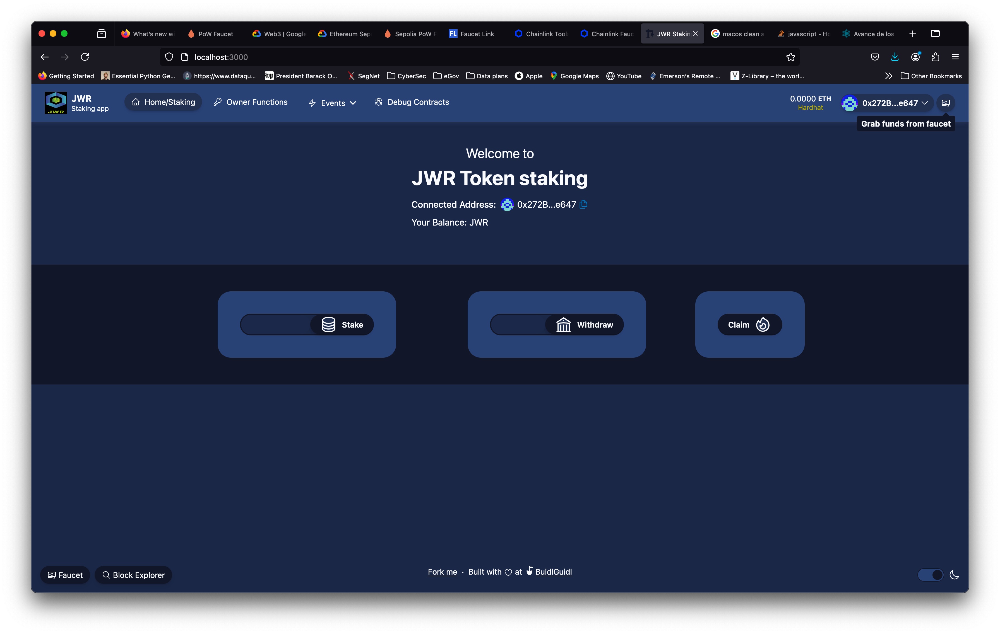
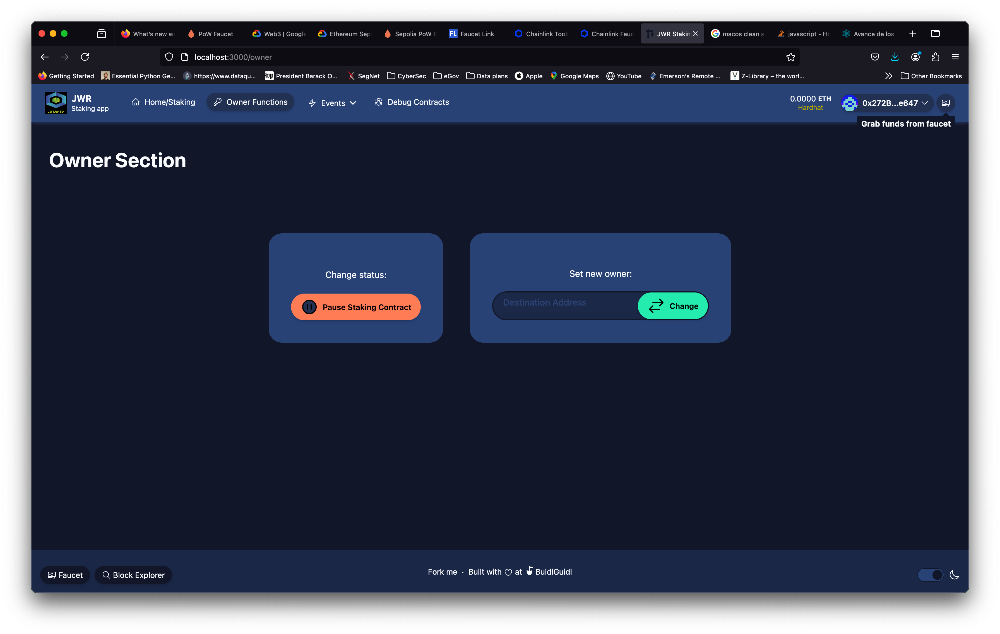
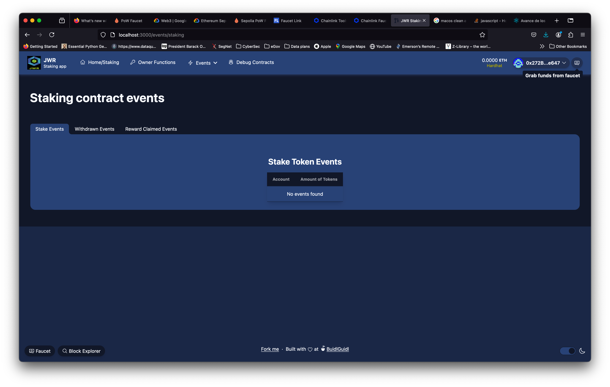
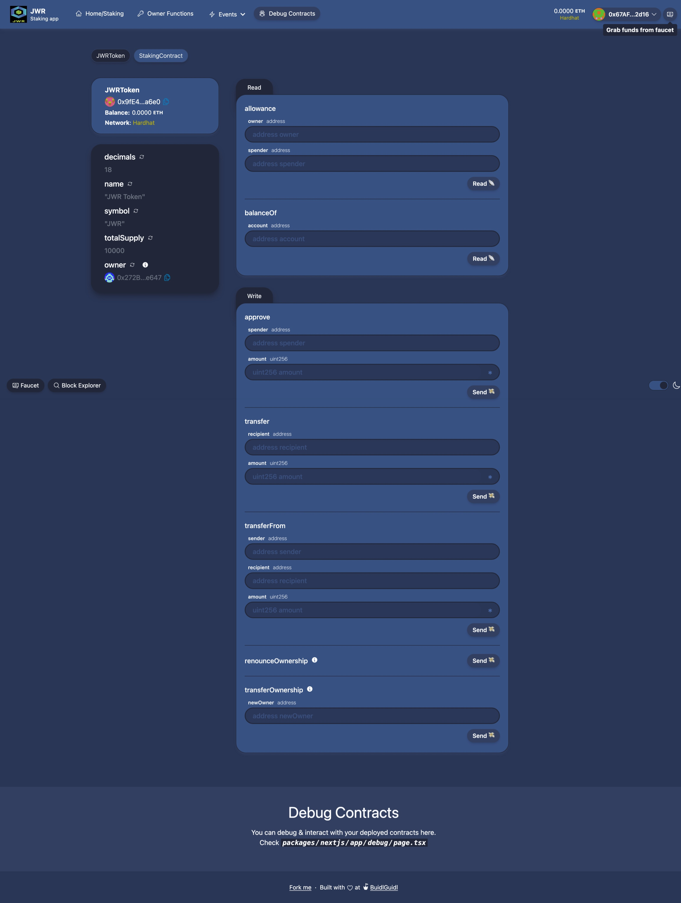
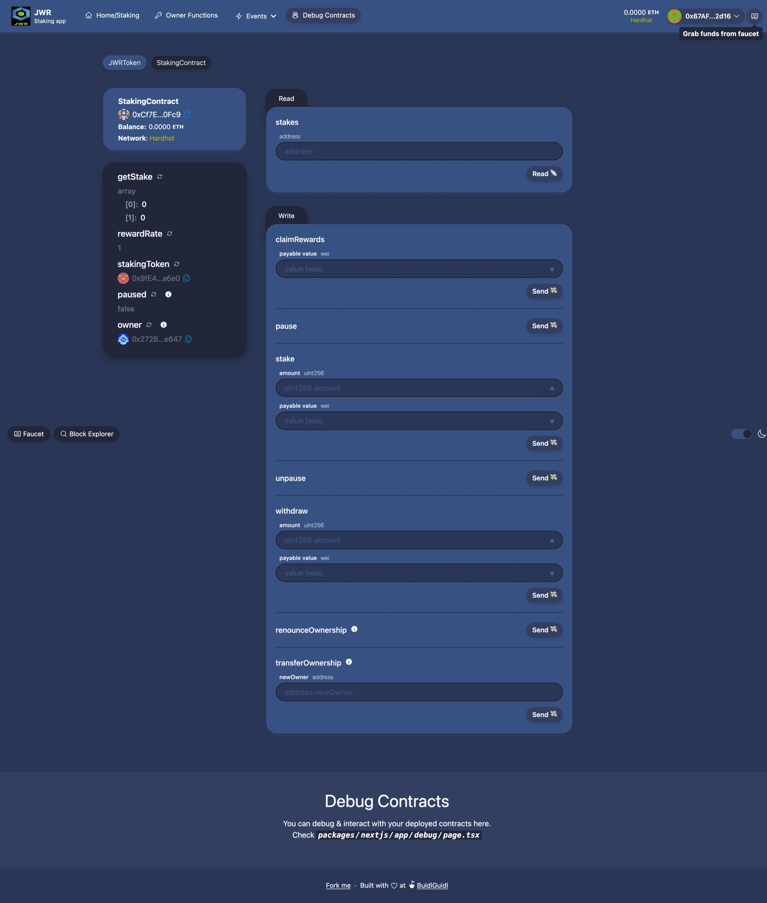
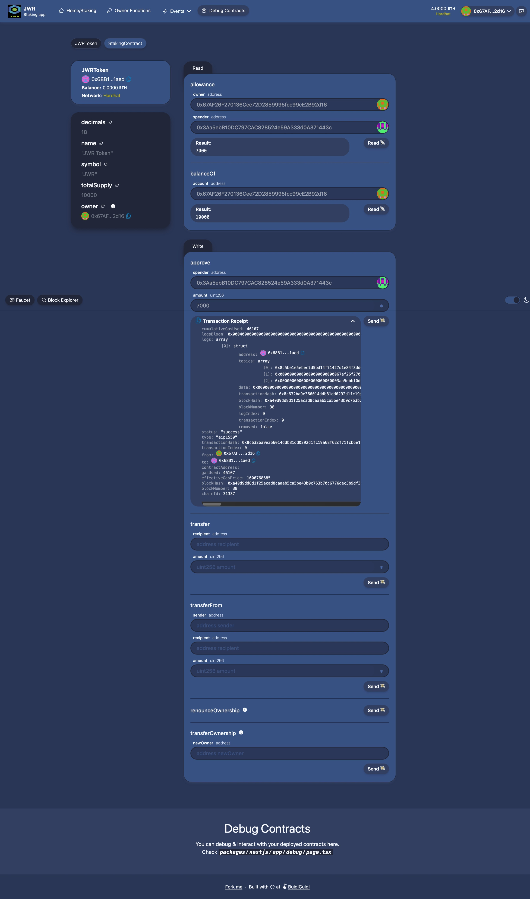
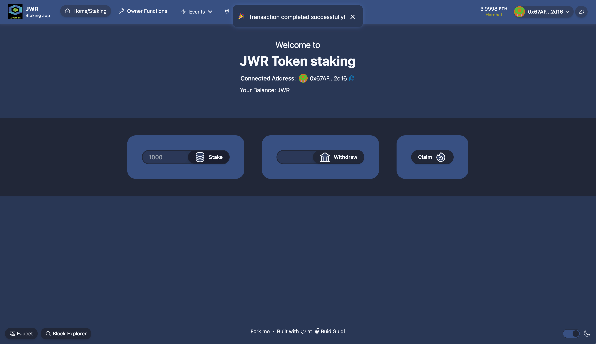
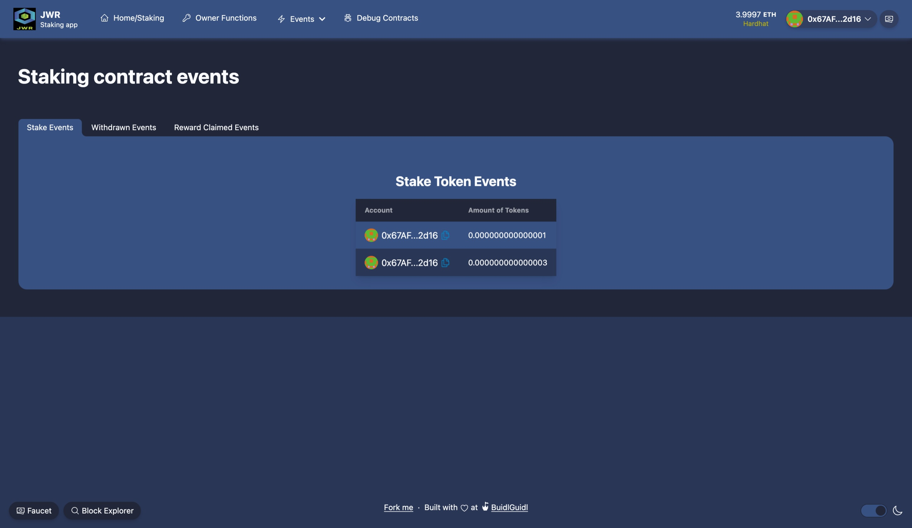
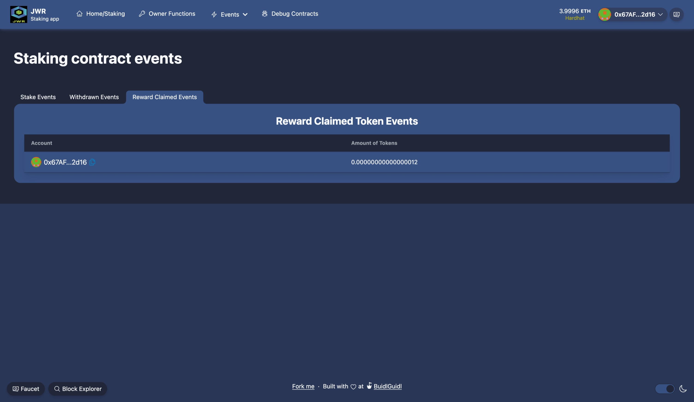
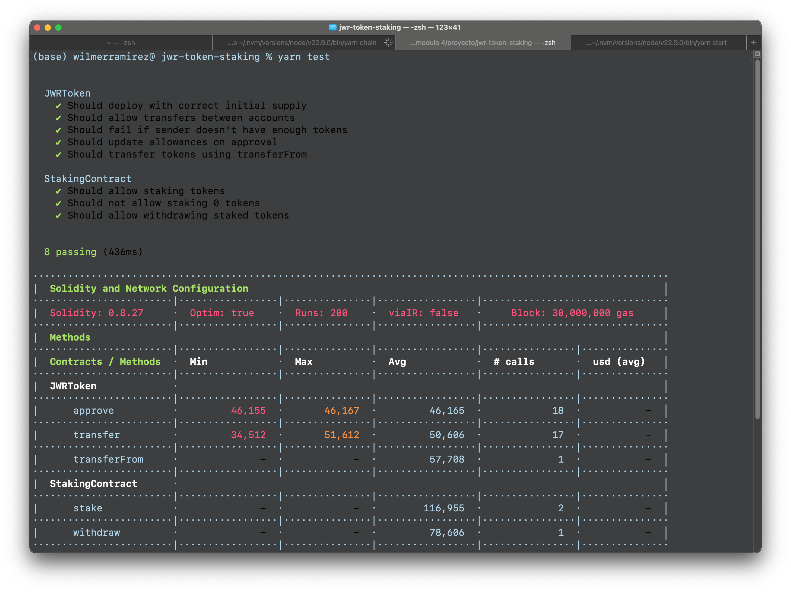

#  Asignación final Modulo 4
## ETH-KIPU Latinoamerica
## ETH Developer Pack 

## Estudiantes

1. Jose Cerdas 
2. Wilmer Ramírez
3. Randall Brenes

## Repositorios

1. Jose Cerdas (https://github.com/joalcg/solidity-staking)
2. Wilmer Ramírez (https://github.com/will17cr/jwr-token-staking)
3. Randall Brenes (https://github.com/randallbrenes/jwr-token-staking)

# 1. Detalles de asignación

 - Conformar un equipo de 3 personas.
 - Importar los contratos realizados en el módulo anterior (Marketplace o Staking) en un entorno de desarrollo profesional como Hardhat,  Foundry o ScaffoldEth.
 - Escribir pruebas unitarias para al menos 3 funcionalidades principales.
 - Desplegar los contratos y validarlos en Etherescan. 
 - Crear una interfaz front end utilizando wagmi, viem o ethers.js para interactuar con al menos una funcionalidad principal.
 - Presentar el resultado en GitHub (un github dónde todos contribuyan, un fork por persona, o un repositorio individual por persona) 
 - El Github debe tener un readme con un link a el o los contratos validados y los nombres de los miembros del equipo con el link a cada uno de los perfiles de Github.

# 2. Resultados de implementación

## 2.1. Sobre implementación

1. Contrato de **`Staking`** de **`IERC20`**, _token inmutable_
2. Contrato de  _token_ personalizado `JWR Token (JWR)` para probar el contrato de _Staking_ con conformidad de **`ERC20`** o **`IERC20`**.
3. Implementación y verificación de contrato **`JWRToken`** en Sepolia (https://sepolia.etherscan.io/address/0xc54f21d2df3f06652aed21adecbb0268f7d84dd1#code)
4. Implementación y verificación de contrato **`Staking`** en Sepolia (https://sepolia.etherscan.io/address/0x9867E5BCFFc8dc37eC9DC7E9416de06a631CE7B6#code)
5. Interfaz **`hardhat`** basada en proyecto demo `Scaffold-ETH 2` para acceso y uso de contratos mediante página web.
6. Implementación de 8 pruebas unitarias. 

## 2.2. Explicación de contratos

## 2.2.1 Contrato `StakingContract`

1. Contrato de _staking_ de _tokens_ basado en **`IERC20`**, se premia a usuarios que ceden una cantidad de _tokens_ al contrato, el rendimiento lo calcula como cantidad de _tokens_ cedidos por tiempo transcurrido a una tasa definida. 
2. Creación de contrato solicita uso de _token_ conforme con **`IERC20`** y tasa de recompensa **`rewardRate`**, que se considera en la práctica como **`rewardRate/100000000000`** _token_ por segundo por _token_ cedido.
3. Función **`stake()`** para transferir _tokens_ de usuario al contrato de _staking_.
4. Función **`withdraw()`** para retirar _tokens_ cedidos de vuelta al dueño, este solicita un monto a retirar como entrada.
5. Función **`claimRewards()`** para retirar todos los _tokens_ recompensados (el rendimiento o premio actual).
6. Función **`_updateRewards()`** para actualizar recompensa de rendimiento, actualiza los _tokens_ de **`rewardEarned`** y el tiempo de conteo **`timestamp`**. Esta función está implementada dentro de las operaciones que implican transferencia. Antes de hacer cualquier transferencia dentro de `stake()`,`withdraw()` y `claimRewards()` primero se calcula recompensa y luego se ejecuta transferencia.
7. Función **`getStake()`** para obtener posición actual de usuario en el contrato (devuelve el monto actual cedido y las recompensas calculadas las última vez que se hizo transferencia).
8. Funciones `pause` y `unpause` como mecanismos de seguridad para pausar contrato, permisible únicamente para el dueño.
9. Registro de evento para `stake`, `withdraw`, `claimRewards`.

## 2.2.2 Contrato `JWRToken`

Contrato de token `Ownable` conforme con `ERC20` con funciones básicas de `_mint()`,`approve()`,`allowance()`,`transfer()`, `transferFrom()`,`balanceOf()`,`totalSupply()`. 

# 2.3 Interfaz web

## 2.3.1 Detalles de interfaz web

1. Interfaz web basada en proyecto demo de `HardHat` y modificado para contrato `StakingContract`
2. Páginas de **`Home/Staking`**, **`Owner Functions`**, **`Events`**, **`Debug Contract`**.
3. Página de **`Home/Staking`** con botones de `stake`, `withdraw` y `claimRewards`
4. Página de **`Owner functions`** con operaciones para **pausar contrato** (`Pause Staking Contract`) y **cambiar de dueño** (`Set new owner: <<address>> Change`).
5. Página de **`Events`** para ver registro de eventos generados por los contratos.
6. Página de **`Debug Contract`** para pruebas y uso de funciones manuales.

## 2.3.2 Captura de pantallas de interfaz web

### Home/Staking



### Owner functions



### Events



### Debug Contract





## 2.3.3 Evidencia de algunas pruebas con interfaz web

### Operaciones con token `JWR`



### Pausa de contrato


### Stake en página _Home/Staking_



### Eventos





# 2.4 Pruebas unitarias

## 2.4.1 Detalles de pruebas unitarias

1. Archivos de pruebas unitarias por contrato, `StakingContract` y `JWRToken`
2. Pruebas de `JWRToken`
    
  - Verificar que se despliegue con cantidad correcta de suministro (Should deploy with correct initial supply).
  - Verificar que se pueden hacer transferencias entre cuentas (Should allow transfers between accounts).
  - Verificar que falla transferencia si remitente no tiene suficientes _tokens_ (Should fail if sender doesn't have enough tokens).
  - Verificar que se actualicen montos permitidos al aprobarse (Should update allowances on approval).
  - Verificar que se transfieran tokens usando `transferFrom` (Should transfer tokens using transferFrom).

3. Pruebas de `StakingContract`

  - Verificar que se permite el _stake_  de _tokens_ (Should allow staking tokens).
  - Verificar que no se permite _stake_ con 0 _tokens_ (Should not allow staking 0 tokens).
  - Verificar que se permite el retiro de _tokens_ en _stake_ (Should allow withdrawing staked tokens).

## 2.4.2 Evidencia de pruebas unitarias

### Captura de pantalla



### Salida de terminal

```
% yarn test


  JWRToken
    ✔ Should deploy with correct initial supply
    ✔ Should allow transfers between accounts
    ✔ Should fail if sender doesn't have enough tokens
    ✔ Should update allowances on approval
    ✔ Should transfer tokens using transferFrom

  StakingContract
    ✔ Should allow staking tokens
    ✔ Should not allow staking 0 tokens
    ✔ Should allow withdrawing staked tokens


  8 passing (436ms)

·············································································································
|  Solidity and Network Configuration                                                                       │
························|·················|···············|·················|································
|  Solidity: 0.8.27     ·  Optim: true    ·  Runs: 200    ·  viaIR: false   ·     Block: 30,000,000 gas     │
························|·················|···············|·················|································
|  Methods                                                                                                  │
························|·················|···············|·················|················|···············
|  Contracts / Methods  ·  Min            ·  Max          ·  Avg            ·  # calls       ·  usd (avg)   │
························|·················|···············|·················|················|···············
|  JWRToken             ·                                                                                   │
························|·················|···············|·················|················|···············
|      approve          ·         46,155  ·       46,167  ·         46,165  ·            18  ·           -  │
························|·················|···············|·················|················|···············
|      transfer         ·         34,512  ·       51,612  ·         50,606  ·            17  ·           -  │
························|·················|···············|·················|················|···············
|      transferFrom     ·              -  ·            -  ·         57,708  ·             1  ·           -  │
························|·················|···············|·················|················|···············
|  StakingContract      ·                                                                                   │
························|·················|···············|·················|················|···············
|      stake            ·              -  ·            -  ·        116,955  ·             2  ·           -  │
························|·················|···············|·················|················|···············
|      withdraw         ·              -  ·            -  ·         78,606  ·             1  ·           -  │
························|·················|···············|·················|················|···············
|  Deployments                            ·                                 ·  % of limit    ·              │
························|·················|···············|·················|················|···············
|  JWRToken             ·              -  ·            -  ·        559,705  ·         1.9 %  ·           -  │
························|·················|···············|·················|················|···············
|  StakingContract      ·              -  ·            -  ·        773,024  ·         2.6 %  ·           -  │
························|·················|···············|·················|················|···············
|  Key                                                                                                      │
·············································································································
|  ◯  Execution gas for this method does not include intrinsic gas overhead                                 │
·············································································································
|  △  Cost was non-zero but below the precision setting for the currency display (see options)              │
·············································································································
|  Toolchain:  hardhat                                                                                      │
·············································································································
```

# 🏗 Scaffold-ETH 2 (README.md original del proyecto base)

<h4 align="center">
  <a href="https://docs.scaffoldeth.io">Documentación</a> |
  <a href="https://scaffoldeth.io">Website</a>
</h4>

🧪 Un _toolkit_ actualizado y de código abierto (_open-source_) para construir aplicaciones descentralizadas (**`DApps`**) en _blockchain_ de _Ethereum_. Está diseñado para facilitarle a los desarrolladores la creación y despliegue de contratos inteligentes y crear interfaces de usuario que interactúen con esos contratos.

⚙️ Desarrollado con `NextJS`, `RainbowKit`, `Hardhat`, `Wagmi`, `Viem` y `Typescript`.

- ✅ **Adaptación en caliente de contrato**: Tu _frontend_ se auto adapta a tu contrato inteligente a como lo vas editando.
- 🪝 **[_Hooks_ personalizados](https://docs.scaffoldeth.io/hooks/)**: Colección de _wrappers_ de _hooks_ en React alrededor de [wagmi](https://wagmi.sh/) para simplificar interacciones con contratos inteligentes con autocomplete de typescript.
- 🧱 [**Componentes**](https://docs.scaffoldeth.io/components/): Colección de componentes comunes de web3  para construir rápidamente tu _frontend_.
- 🔥 **Billeteras de quemado y _faucet_ locales**: Prueba rápidamente tu  aplicación usando billeteras de quemados y _faucet_ (fuente de tokens) generada localmente.
- 🔐 **Integración con proveedores de billeteras (_Wallet_)**: Conéctate a diferentes proveedores de billetera e interactúa con la red _Ethereum_.


## Requisitos

Antes de empezar, necesitas instalar las siguientes herramientas:

- [Node (>= v18.18)](https://nodejs.org/en/download/)
- Yarn ([v1](https://classic.yarnpkg.com/en/docs/install/) or [v2+](https://yarnpkg.com/getting-started/install))
- [Git](https://git-scm.com/downloads)

## Inicio rápido (_Quickstart_)

Para empezar a usar _Scaffold-ETH 2_, sigue los siguientes pasos:

1. Clona este repo e instala dependencias

```
git clone https://github.com/scaffold-eth/scaffold-eth-2.git
cd scaffold-eth-2
yarn install
```

2. Despliega una red local en un primer terminal:

```
yarn chain
```

Este comando inicia una red local _Ethereum_ usando Hardhat. La red corre en tu máquina local y puede ser usada para prueba y desarrollo. Puedes personalizar la configuración de red en `hardhat.config.ts`.

3. En un segundo terminal, despliega el contrato:

```
yarn deploy
```

Este comando despliega una prueba de tu contrato inteligente en tu red local. El contrato se localiza en  `packages/hardhat/contracts` y se puede modificar según tus necesidades. El comando `yarn deploy` usa el script de despliegue en `packages/hardhat/deploy` para desplegar el contrato en la red. También puedes personalizar el script de despliegue.

4. En un tercer terminal, inicializa tu app NextJS:

```
yarn start
```

Accede a tu app en `http://localhost:3000`. Puedes interactuar con tu contrato usando la página `Debug Contracts`. Puedes personalizar la configuración de app en `packages/nextjs/scaffold.config.ts`.


## Documentación

Visita la documentación en [docs](https://docs.scaffoldeth.io) para aprender como empeza a construir con Scaffold-ETH 2.

Para saber más de las características, chequea el [website](https://scaffoldeth.io).

