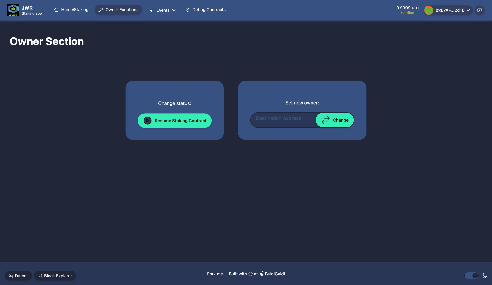

#  Asignación final Modulo 4
## ETH-KIPU Latinoamerica
## ETH Developer Pack 

## Estudiantes

1. Jose Cerdas 
2. Wilmer Ramírez
3. Randall Brenes

## Repositorios

1. Jose Cerdas (https://github.com/joalcg/solidity-staking)
2. Wilmer Ramírez (https://github.com/will17cr/jwr-token-staking)
3. Randall Brenes (https://github.com/randallbrenes/jwr-token-staking)

# 1. Detalles de asignación

 - Conformar un equipo de 3 personas.
 - Importar los contratos realizados en el módulo anterior (Marketplace o Staking) en un entorno de desarrollo profesional como Hardhat,  Foundry o ScaffoldEth.
 - Escribir pruebas unitarias para al menos 3 funcionalidades principales.
 - Desplegar los contratos y validarlos en Etherescan. 
 - Crear una interfaz front end utilizando wagmi, viem o ethers.js para interactuar con al menos una funcionalidad principal.
 - Presentar el resultado en GitHub (un github dónde todos contribuyan, un fork por persona, o un repositorio individual por persona) 
 - El Github debe tener un readme con un link a el o los contratos validados y los nombres de los miembros del equipo con el link a cada uno de los perfiles de Github.

# 2. Resultados de implementación

## 2.1. Sobre implementación

1. Contrato de **`Staking`** de **`IERC20`**, _token inmutable_
2. Contrato de  _token_ personalizado `JWR Token (JWR)` para probar el contrato de _Staking_ con conformidad de **`ERC20`** o **`IERC20`**.
3. Implementación y verificación de contrato **`JWRToken`** en Sepolia (https://sepolia.etherscan.io/address/0xc54f21d2df3f06652aed21adecbb0268f7d84dd1#code)
4. Implementación y verificación de contrato **`Staking`** en Sepolia (https://sepolia.etherscan.io/address/0x9867E5BCFFc8dc37eC9DC7E9416de06a631CE7B6#code)
5. Interfaz **`hardhat`** basada en proyecto demo `Scaffold-ETH 2` para acceso y uso de contratos mediante página web.
6. Implementación de 8 pruebas unitarias. 

## 2.2. Explicación de contratos

## 2.2.1 Contrato `StakingContract`

1. Contrato de _staking_ de _tokens_ basado en **`IERC20`**, se premia a usuarios que ceden una cantidad de _tokens_ al contrato, el rendimiento lo calcula como cantidad de _tokens_ cedidos por tiempo transcurrido a una tasa definida. 
2. Creación de contrato solicita uso de _token_ conforme con **`IERC20`** y tasa de recompensa **`rewardRate`**, que se considera en la práctica como **`rewardRate/100000000000`** _token_ por segundo por _token_ cedido.
3. Función **`stake()`** para transferir _tokens_ de usuario al contrato de _staking_.
4. Función **`withdraw()`** para retirar _tokens_ cedidos de vuelta al dueño, este solicita un monto a retirar como entrada.
5. Función **`claimRewards()`** para retirar todos los _tokens_ recompensados (el rendimiento o premio actual).
6. Función **`_updateRewards()`** para actualizar recompensa de rendimiento, actualiza los _tokens_ de **`rewardEarned`** y el tiempo de conteo **`timestamp`**. Esta función está implementada dentro de las operaciones que implican transferencia. Antes de hacer cualquier transferencia dentro de `stake()`,`withdraw()` y `claimRewards()` primero se calcula recompensa y luego se ejecuta transferencia.
7. Función **`getStake()`** para obtener posición actual de usuario en el contrato (devuelve el monto actual cedido y las recompensas calculadas las última vez que se hizo transferencia).
8. Funciones `pause` y `unpause` como mecanismos de seguridad para pausar contrato, permisible únicamente para el dueño.
9. Registro de evento para `stake`, `withdraw`, `claimRewards`.

## 2.2.2 Contrato `JWRToken`

Contrato de token `Ownable` conforme con `ERC20` con funciones básicas de `_mint()`,`approve()`,`allowance()`,`transfer()`, `transferFrom()`,`balanceOf()`,`totalSupply()`. 

# 2.3 Interfaz web

## 2.3.1 Detalles de interfaz web

1. Interfaz web basada en proyecto demo de `hardhat` y modificado para contrato `StakingContract`
2. Páginas de **`Home/Staking`**, **`Owner Functions`**, **`Events`**, **`Debug Contract`**.
3. Página de **`Home/Staking`** con botones de `stake`, `withdraw` y `claimRewards`
4. Página de **`Owner functions`** con operaciones para **pausar contrato** (`Pause Staking Contract`) y **cambiar de dueño** (`Set new owner: <<address>> Change`).
5. Página de **`Events`** para ver registro de eventos generados por los contratos.
6. Página de **`Debug Contract`** para pruebas y uso de funciones manuales.

## 2.3.2 Captura de pantallas de interfaz web

### Home/Staking


### Owner functions


### Events


### Debug Contract


## 2.3.3 Evidencia de algunas pruebas con interfaz web

### Operaciones con token `JWR`


### Pausa de contrato



### Stake en página _Home/Staking_


### Eventos


# 2.4 Pruebas unitarias

## 2.4.1 Detalles de pruebas unitarias

1. Archivos de pruebas unitarias por contrato, `StakingContract` y `JWRToken`
2. Pruebas de `JWRToken`
    
  - Verificar que se despliegue con cantidad correcta de suministro (Should deploy with correct initial supply).
  - Verificar que se pueden hacer transferencias entre cuentas (Should allow transfers between accounts).
  - Verificar que falla transferencia si remitente no tiene suficientes _tokens_ (Should fail if sender doesn't have enough tokens).
  - Verificar que se actualicen montos permitidos al aprobarse (Should update allowances on approval).
  - Verificar que se transfieran tokens usando `transferFrom` (Should transfer tokens using transferFrom).

3. Pruebas de `StakingContract`

  - Verificar que se permite el _stake_  de _tokens_ (Should allow staking tokens).
  - Verificar que no se permite _stake_ con 0 _tokens_ (Should not allow staking 0 tokens).
  - Verificar que se permite el retiro de _tokens_ en _stake_ (Should allow withdrawing staked tokens).

## 2.4.2 Evidencia de pruebas unitarias

### Captura de pantalla


### Salida de terminal

```
% yarn test


  JWRToken
    ✔ Should deploy with correct initial supply
    ✔ Should allow transfers between accounts
    ✔ Should fail if sender doesn't have enough tokens
    ✔ Should update allowances on approval
    ✔ Should transfer tokens using transferFrom

  StakingContract
    ✔ Should allow staking tokens
    ✔ Should not allow staking 0 tokens
    ✔ Should allow withdrawing staked tokens


  8 passing (436ms)

·············································································································
|  Solidity and Network Configuration                                                                       │
························|·················|···············|·················|································
|  Solidity: 0.8.27     ·  Optim: true    ·  Runs: 200    ·  viaIR: false   ·     Block: 30,000,000 gas     │
························|·················|···············|·················|································
|  Methods                                                                                                  │
························|·················|···············|·················|················|···············
|  Contracts / Methods  ·  Min            ·  Max          ·  Avg            ·  # calls       ·  usd (avg)   │
························|·················|···············|·················|················|···············
|  JWRToken             ·                                                                                   │
························|·················|···············|·················|················|···············
|      approve          ·         46,155  ·       46,167  ·         46,165  ·            18  ·           -  │
························|·················|···············|·················|················|···············
|      transfer         ·         34,512  ·       51,612  ·         50,606  ·            17  ·           -  │
························|·················|···············|·················|················|···············
|      transferFrom     ·              -  ·            -  ·         57,708  ·             1  ·           -  │
························|·················|···············|·················|················|···············
|  StakingContract      ·                                                                                   │
························|·················|···············|·················|················|···············
|      stake            ·              -  ·            -  ·        116,955  ·             2  ·           -  │
························|·················|···············|·················|················|···············
|      withdraw         ·              -  ·            -  ·         78,606  ·             1  ·           -  │
························|·················|···············|·················|················|···············
|  Deployments                            ·                                 ·  % of limit    ·              │
························|·················|···············|·················|················|···············
|  JWRToken             ·              -  ·            -  ·        559,705  ·         1.9 %  ·           -  │
························|·················|···············|·················|················|···············
|  StakingContract      ·              -  ·            -  ·        773,024  ·         2.6 %  ·           -  │
························|·················|···············|·················|················|···············
|  Key                                                                                                      │
·············································································································
|  ◯  Execution gas for this method does not include intrinsic gas overhead                                 │
·············································································································
|  △  Cost was non-zero but below the precision setting for the currency display (see options)              │
·············································································································
|  Toolchain:  hardhat                                                                                      │
·············································································································
```

# 🏗 Scaffold-ETH 2 (README.md original del proyecto base)

<h4 align="center">
  <a href="https://docs.scaffoldeth.io">Documentation</a> |
  <a href="https://scaffoldeth.io">Website</a>
</h4>

🧪 An open-source, up-to-date toolkit for building decentralized applications (dapps) on the Ethereum blockchain. It's designed to make it easier for developers to create and deploy smart contracts and build user interfaces that interact with those contracts.

⚙️ Built using NextJS, RainbowKit, Hardhat, Wagmi, Viem, and Typescript.

- ✅ **Contract Hot Reload**: Your frontend auto-adapts to your smart contract as you edit it.
- 🪝 **[Custom hooks](https://docs.scaffoldeth.io/hooks/)**: Collection of React hooks wrapper around [wagmi](https://wagmi.sh/) to simplify interactions with smart contracts with typescript autocompletion.
- 🧱 [**Components**](https://docs.scaffoldeth.io/components/): Collection of common web3 components to quickly build your frontend.
- 🔥 **Burner Wallet & Local Faucet**: Quickly test your application with a burner wallet and local faucet.
- 🔐 **Integration with Wallet Providers**: Connect to different wallet providers and interact with the Ethereum network.


## Requirements

Before you begin, you need to install the following tools:

- [Node (>= v18.18)](https://nodejs.org/en/download/)
- Yarn ([v1](https://classic.yarnpkg.com/en/docs/install/) or [v2+](https://yarnpkg.com/getting-started/install))
- [Git](https://git-scm.com/downloads)

## Quickstart

To get started with Scaffold-ETH 2, follow the steps below:

1. Clone this repo & install dependencies

```
git clone https://github.com/scaffold-eth/scaffold-eth-2.git
cd scaffold-eth-2
yarn install
```

2. Run a local network in the first terminal:

```
yarn chain
```

This command starts a local Ethereum network using Hardhat. The network runs on your local machine and can be used for testing and development. You can customize the network configuration in `hardhat.config.ts`.

3. On a second terminal, deploy the test contract:

```
yarn deploy
```

This command deploys a test smart contract to the local network. The contract is located in `packages/hardhat/contracts` and can be modified to suit your needs. The `yarn deploy` command uses the deploy script located in `packages/hardhat/deploy` to deploy the contract to the network. You can also customize the deploy script.

4. On a third terminal, start your NextJS app:

```
yarn start
```

Visit your app on: `http://localhost:3000`. You can interact with your smart contract using the `Debug Contracts` page. You can tweak the app config in `packages/nextjs/scaffold.config.ts`.


## Documentation

Visit our [docs](https://docs.scaffoldeth.io) to learn how to start building with Scaffold-ETH 2.

To know more about its features, check out our [website](https://scaffoldeth.io).

